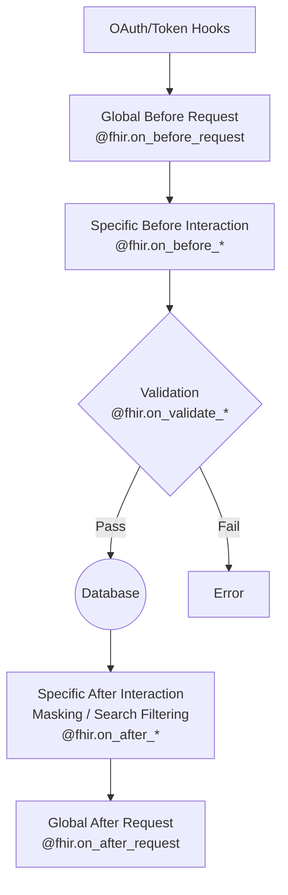

# InterSystems IRIS FHIR Python Strategy

A flexible Python-based strategy for customizing InterSystems IRIS FHIR Server behavior using decorators.

## Overview

This project provides a bridge between the high-performance InterSystems IRIS FHIR Server and Python. It allows developers to customize FHIR operations (Create, Read, Update, Delete, Search) and implement business logic (Consent, Validation, OAuth) using familiar Python decorators.

## Features

- **Full CRUD Hook Support**: Pre-processing (`on_before_`) and post-processing (`on_after_`) hooks for all interactions.
- **Pythonic API**: Use decorators like `@fhir.on_before_create("Patient")` to register handlers.
- **Consent Management**: Implement fine-grained consent rules.
- **Custom Operations**: Easily add `$operations` in Python.
- **Validation**: Custom resource and bundle validation.
- **OAuth Customization**: Hooks for token introspection and user context.
- **Two-tier Context Management**: Thread-safe, per-request `RequestContext` and long-lived service-level `InteractionsContext` — no more `threading.local` boilerplate.

## Prerequisites

- [Docker](https://docs.docker.com/get-docker/)
- [Docker Compose](https://docs.docker.com/compose/install/)
- Git

## Quick Start

1. **Clone the repository**
   ```bash
   git clone https://github.com/grongierisc/iris-fhir-python-strategy.git
   cd iris-fhir-python-strategy
   ```

2. **Start the containers**
   ```bash
   docker-compose up -d
   ```

3. **Verify Installation**
   Access the FHIR metadata endpoint:
   ```bash
   curl http://localhost:8083/fhir/r4/metadata
   ```

## Usage Guide

### Defining Custom Logic

1. Open `examples/custom_decorators.py` (or create your own module).
2. Import the `fhir` registry from `iris_fhir_python_strategy`.
3. Decorate your functions to register them as handlers.

### Detailed Examples

#### 1. Global Request Logic (e.g., Scope Verification)
Intercept every request to check for required scopes.

```python
from iris_fhir_python_strategy import fhir

@fhir.on_before_request
def check_scope(service: Any, request: Any, body: dict, timeout: int):
    """
    Ensure the user has the 'VIP' scope for processing.
    """
    token = request.AdditionalInfo.GetAt("USER:OAuthToken") or ""
    if token:
        decoded_token = jwt.decode(token, options={"verify_signature": False})
        scope_list = decoded_token.get("scope", "").split(" ")
        if "VIP" not in scope_list:
            raise ValueError("Insufficient scope: VIP required")
```

#### 2. Validation Logic
Validate resources before they are saved to the database.

Handlers can signal outcomes in three ways:
- **Raise an exception** (`ValueError`) — the message is wrapped in a single OperationOutcome error issue and the request is rejected (400).
- **Return an OperationOutcome dict with `severity == "error"` issues** — all error issues are collected and returned as a 400 response, allowing multiple granular errors with expression paths.
- **Return an OperationOutcome dict with only non-error issues** (`warning`, `information`) — the request is **allowed through** but the outcome is recorded. Use this to annotate without blocking.
- **Return `None`** (or omit a `return` statement) — validation passes silently.

```python
from iris_fhir_python_strategy import fhir

# --- 1. Raise: simple single-error case ---
@fhir.on_validate_resource("Patient")
def validate_patient_name(resource_object: Dict, is_in_transaction: bool = False):
    for name in resource_object.get("name", []):
        if name.get("family") == "Forbidden":
            raise ValueError("This family name is not allowed")

# --- 2. Return OperationOutcome (errors) : multi-error, path-aware ---
@fhir.on_validate_resource("Patient")
def validate_patient_fields(resource_object: Dict, is_in_transaction: bool = False):
    issues = []
    if "identifier" not in resource_object:
        issues.append({
            "severity": "error",
            "code": "required",
            "details": {"text": "Patient must have at least one identifier"},
            "expression": ["Patient.identifier"],
        })
    for i, name in enumerate(resource_object.get("name", [])):
        if name.get("use") not in ["official", "usual", None]:
            issues.append({
                "severity": "error",
                "code": "value",
                "details": {"text": f"Invalid name use: {name.get('use')}"},
                "expression": [f"Patient.name[{i}].use"],
            })
    if issues:
        return {"resourceType": "OperationOutcome", "issue": issues}

# --- 3. Return OperationOutcome (warnings only) : passes through, does not block ---
@fhir.on_validate_resource("Practitioner")
def suggest_qualification(resource_object: Dict, is_in_transaction: bool = False):
    """Warning-only: the resource is saved, the advisory is recorded."""
    if "qualification" not in resource_object:
        return {
            "resourceType": "OperationOutcome",
            "issue": [{
                "severity": "warning",
                "code": "informational",
                "details": {"text": "Practitioner.qualification is recommended"},
                "expression": ["Practitioner.qualification"],
            }],
        }

# --- Bundle validation ---
@fhir.on_validate_bundle
def validate_bundle(resource_object: Dict, fhir_version: str):
    """resource_object is the bundle dict; fhir_version is e.g. 'R4'."""
    issues = []
    if resource_object.get("type") == "transaction":
        if len(resource_object.get("entry", [])) > 100:
            issues.append({
                "severity": "error",
                "code": "too-costly",
                "details": {"text": "Transaction bundle too large (max 100 entries)"},
                "expression": ["Bundle.entry"],
            })
    if issues:
        return {"resourceType": "OperationOutcome", "issue": issues}
```

#### 3. Pre-Processing Hooks (Modification)
Modify the incoming resource or metadata before the server processes it.

```python
@fhir.on_before_create("Observation")
def enrich_observation(service: Any, request: Any, body: dict, timeout: int):
    """
    Automatically add a tag to all new Observations.
    """
    meta = body.setdefault("meta", {})
    tags = meta.setdefault("tag", [])
    tags.append({
        "system": "http://my-hospital.org/tags",
        "code": "auto-generated",
        "display": "Auto Generated"
    })
```

#### 4. Post-Processing Hooks (Masking/Filtering)
Modify or filter the response *after* the database operation but *before* sending it to the client.

```python
from iris_fhir_python_strategy import fhir, get_request_context

@fhir.on_after_read("Patient")
def mask_patient_data(resource: Dict) -> bool:
    """
    Mask sensitive fields for non-admin users.
    Returns:
        True: Return the resource (modified or not).
        False: Hide the resource (client receives 404).
    """
    # Retrieve the request-scoped context populated by on_before_request
    ctx = get_request_context()
    user_role = "admin" if "admin" in ctx.roles else "user"  # ctx.roles, not ctx.requesting_roles

    if user_role != "admin":
        # Remove telecom info
        if "telecom" in resource:
            del resource["telecom"]
        
        # Obfuscate birth date
        if "birthDate" in resource:
            resource["birthDate"] = "1900-01-01"
            
    return True
```

#### 5. Custom Operations ($operation)
Implement custom FHIR operations using Python functions.

```python
@fhir.operation(name="echo", scope="Instance", resource_type="Patient")
def echo_patient_operation(name: str, scope: str, body: dict, service: Any, request: Any, response: Any):
    """
    Implements POST /Patient/{id}/$echo
    """
    # Logic: Just reflect the input body and operation details
    response_payload = {
        "resourceType": "Parameters",
        "parameter": [
            {"name": "operation", "valueString": name},
            {"name": "received_body", "resource": body}
        ]
    }
    
    # Set the response payload
    # Note: 'response' is the IRIS response object wrapper
    response.Json = response_payload
    return response
```

#### 6. Search Filtering (Row-Level Security)
Intercept search results to enforce fine-grained access control.

```python
@fhir.on_after_search("Patient")
def filter_search_results(result_set: Any, resource_type: str):
    """
    Iterate through search results and remove restricted items.
    'result_set' is an iris.HS.FHIRServer.Util.SearchResult object.
    """
    # Iterate over the result set
    result_set._SetIterator(0)
    while result_set._Next():
        # Get resource content or ID
        resource_id = result_set._Get("ResourceId")
        
        # Example validation logic
        if resource_id.startswith("restricted-"):
            # Mark this row as deleted so it is excluded from the Bundle
            result_set.MarkAsDeleted()
            result_set._SaveRow()
```

#### 7. Context Management

The library provides two thread-safe context objects that cover different lifetimes:

| | `RequestContext` | `InteractionsContext` |
|---|---|---|
| **Lifetime** | One FHIR HTTP request | Entire process lifetime |
| **Isolation** | Per-thread / per-asyncio-task (`ContextVar`) | Shared singleton across all requests |
| **Use for** | Authenticated user, roles, OAuth token | Caches, ML models, HTTP sessions, config |
| **Access** | `get_request_context()` | `get_interactions_context()` |

##### RequestContext — per-request data

`RequestContext` is created fresh at the start of every request by the IRIS bridge and destroyed when the request ends. Handlers read and mutate it freely.

```python
from iris_fhir_python_strategy import fhir, get_request_context

@fhir.on_before_request
def capture_user(fhir_service, fhir_request, body, timeout):
    ctx = get_request_context()      # always the current request's instance
    ctx.username = fhir_request.Username
    ctx.roles    = fhir_request.Roles

@fhir.on_before_delete("Patient")
def require_admin(fhir_service, fhir_request, body, timeout):
    ctx = get_request_context()
    if "admin" not in ctx.roles:
        raise PermissionError("Only admins may delete patients")
```

Built-in typed fields on `RequestContext`:

| Field | Type | Set by |
|---|---|---|
| `username` | `str` | `on_before_request` handler or `oauth_set_instance` |
| `roles` | `str` | `on_before_request` handler |
| `scope_list` | `list[str]` | OAuth pipeline |
| `security_list` | `list[str]` | Application code |
| `token_string` | `str` | `oauth_set_instance` |
| `oauth_client` | `str` | `oauth_set_instance` |
| `base_url` | `str` | `oauth_set_instance` |
| `interactions` | `Any` | IRIS bridge (`begin_request`) |

Any additional attribute can be set dynamically: `ctx.last_operation = "create"`.

##### InteractionsContext — service-level state

`InteractionsContext` is a singleton that lives for the lifetime of the IRIS process. Use it to cache objects that are expensive to recreate on every request.

```python
from iris_fhir_python_strategy import fhir, get_interactions_context
import requests as http_lib
import json

# Module-level initialisation — runs once when the module is imported
ictx = get_interactions_context()
ictx.http_session = http_lib.Session()            # reuse TCP connections
ictx.config       = json.load(open("/app/cfg.json"))

@fhir.on_before_create("Patient")
def enrich_from_external_api(fhir_service, fhir_request, body, timeout):
    ictx = get_interactions_context()
    # Reuse the long-lived session — no reconnect overhead
    extra = ictx.http_session.get("https://api.example.com/enrich").json()
    body["extension"] = body.get("extension", []) + [extra]
```

> **Note**: `ictx.interactions` holds the live IRIS `Interactions` ObjectScript object injected by the IRIS bridge. Use it to call back into IRIS from Python.

#### 8. Customizing Capability Statement
Remove unsupported resources or add documentation.

```python
@fhir.on_capability_statement
def customize_metadata(capability_statement: Dict) -> Dict:
    """
    Remove 'Account' resource from the metadata.
    """
    rest_def = capability_statement['rest'][0]
    resources = rest_def['resource']
    
    # Filter out Account
    rest_def['resource'] = [r for r in resources if r['type'] != 'Account']
    
    return capability_statement
```

## Available Decorators

### Execution Pipeline

For any given FHIR request, decorators execute in the following sequence:

1.  **OAuth/Token Hooks**: Authentication and context setup (`@fhir.oauth_*`).
2.  **`@fhir.on_before_request`**: Global pre-processing (Logs, Auth).
3.  **`@fhir.on_before_create`** (or read/update/delete/search): Interaction-specific pre-processing.
4.  **`@fhir.on_validate_resource`**: Custom validation logic.
5.  **Database Operation**: The core FHIR server processing (Saving/Retrieving).
6.  **`@fhir.on_after_create`** (or read/update/delete/search): Interaction-specific post-processing and **Search Filtering** (Row-Level Security).
7.  **`@fhir.on_after_request`**: Global post-processing (Cleanup).


```mermaid
graph TD
    Auth["OAuth/Token Hooks"] --> A["Global Before Request<br/>@fhir.on_before_request"]
    A --> B["Specific Before Interaction<br/>@fhir.on_before_*"]
    B --> V{"Validation<br/>@fhir.on_validate_*"}
    V -->|Pass| C(("Database"))
    V -->|Fail| Err["Error"]
    C --> D["Specific After Interaction<br/>Masking / Search Filtering<br/>@fhir.on_after_*"]
    D --> E["Global After Request<br/>@fhir.on_after_request"]
```

### Interaction Hooks

These hooks allow you to intercept and modify standard FHIR interactions.

**Execution Order Rule**: When multiple handlers are registered for the same interaction (e.g., global, specific, and wildcard), they execute in this strict order:
1.  **Global Handlers**: `@fhir.hook()` (No arguments)
2.  **Specific Resource**: `@fhir.hook("Patient")`
3.  **Wildcard Handlers**: `@fhir.hook("*")`

#### Pre-Process Hooks
Runs before database operation. Signature: `def handler(fhir_service, fhir_request, body, timeout):`

*   `@fhir.on_before_create(resource_type)`
*   `@fhir.on_before_read(resource_type)`
*   `@fhir.on_before_update(resource_type)`
*   `@fhir.on_before_delete(resource_type)`
*   `@fhir.on_before_search(resource_type)`

#### Post-Process Hooks
Runs after database operation.

*   `@fhir.on_after_create(resource_type)`
    *   Signature: `def handler(fhir_service, fhir_request, fhir_response, body):`
*   `@fhir.on_after_update(resource_type)`
    *   Signature: `def handler(fhir_service, fhir_request, fhir_response, body):`
*   `@fhir.on_after_delete(resource_type)`
    *   Signature: `def handler(fhir_service, fhir_request, fhir_response, body):`
*   `@fhir.on_after_read(resource_type)`
    *   Signature: `def handler(resource):` -> Returns `bool` (False to hide/404)
*   `@fhir.on_after_search(resource_type)`
    *   Signature: `def handler(result_set, resource_type):`

*Note: `resource_type` is optional. If omitted, applies to **all** types.*

### Global Request Hooks

*   `@fhir.on_before_request`
    *   Runs before **any** interaction. Useful for logging or setting up user context.
    *   **Triggers**: Before `@fhir.on_before_{interaction}`.
    *   Signature: `def handler(fhir_service, fhir_request, body, timeout):`
*   `@fhir.on_after_request`
    *   Runs after **any** interaction sequence. Useful for cleanup.
    *   **Triggers**: After `@fhir.on_after_{interaction}`.
    *   Signature: `def handler(fhir_service, fhir_request, fhir_response, body):`

### Capability Statement

*   `@fhir.on_capability_statement`
    *   Customize the server's CapabilityStatement (Metadata).
    *   Signature: `def handler(capability_statement):` -> Returns `dict`

### Custom Operations

*   `@fhir.operation(name, scope, resource_type)`
    *   Implement custom FHIR operations (e.g., `$diff`).
    *   Signature: `def handler(operation_name, operation_scope, body, fhir_service, fhir_request, fhir_response):`

### OAuth & Security

*   `@fhir.oauth_get_user_info`
    *   Extract user info from token.
    *   Signature: `def handler(username, roles):` -> Returns `dict`
*   `@fhir.oauth_get_introspection`
    *   Customize token introspection.
    *   Signature: `def handler():` -> Returns `dict`
*   `@fhir.consent(resource_type)`
    *   Implement consent logic.
    *   Signature: `def handler(resource):` -> Returns `bool`
*   `@fhir.oauth_verify_resource_id(resource_type)`
    *   Verify access by Resource ID.
    *   Signature: `def handler(resource_type, resource_id, required_privilege):` -> Returns `bool`
*   `@fhir.oauth_verify_resource_content(resource_type)`
    *   Verify access by Resource Content.
    *   Signature: `def handler(resource_dict, required_privilege, allow_shared):` -> Returns `bool`
*   `@fhir.oauth_verify_search(resource_type)`
    *   Verify access for Search parameters.
    *   Signature: `def handler(resource_type, compartment_type, compartment_id, parameters, required_privilege):` -> Returns `bool`
*   `@fhir.oauth_verify_system_level`
    *   Verify system administration privileges.
    *   Signature: `def handler():` -> Returns `bool`

### Validation

*   `@fhir.on_validate_resource(resource_type)`
    *   Custom logic to validate a resource.
    *   Signature: `def handler(resource_object: dict, is_in_transaction: bool = False) -> dict | None:`
    *   `resource_object` — the resource dict being validated (parameter was renamed from `resource` to `resource_object`).
    *   Returns: An OperationOutcome dict to report structured errors, or `None`/raise an exception for a simple single-error case.
*   `@fhir.on_validate_bundle`
    *   Custom logic to validate a bundle.
    *   Signature: `def handler(resource_object: dict, fhir_version: str) -> dict | None:`
    *   `resource_object` — the bundle dict being validated (parameter was renamed from `bundle` to `resource_object`).
    *   Returns: An OperationOutcome dict to report structured errors, or `None`/raise an exception.

> **Migration note**: The first parameter of all `on_validate_*` handlers was renamed from `resource`/`bundle` to `resource_object` in line with the rest of the codebase. Handlers using the old name still work (Python doesn't enforce parameter names at call sites), but updating to `resource_object` is recommended for consistency.

### Context Management

*   `get_request_context() -> RequestContext`
    *   Returns the `RequestContext` for the current request. Safe to call from any handler — returns an empty context when called outside the IRIS request lifecycle.
*   `get_interactions_context() -> InteractionsContext`
    *   Returns the service-level singleton. Same instance across all requests.
*   `request_context(**kwargs)` *(context manager — for tests only)*
    *   Provides an isolated `RequestContext` pre-populated with kwargs for the duration of the `with` block.
*   `interactions_context(**kwargs)` *(context manager — for tests only)*
    *   Provides an isolated `InteractionsContext` for the duration of the `with` block.

## Configuration

The strategy is configured via environment variables in `docker-compose.yml`:

- `FHIR_CUSTOMIZATION_MODULE`: The Python module to load (default: `examples.custom_decorators`).
- `FHIR_CUSTOMIZATION_PATH`: Path to the Python code (default: `/irisdev/app/`).

## Architecture

1. **`iris_fhir_python_strategy/cls/FHIR/Python/Interactions.cls`**: The ObjectScript class that intercepts every FHIR request. Calls `begin_request` / `end_request` around each request and `init_interactions` once at service start.
2. **`iris_fhir_python_strategy/fhir_decorators.py`**: The Python decorator registry — maps handler functions to their hooks.
3. **`iris_fhir_python_strategy/request_context.py`**: Two-tier context management — `RequestContext` (per-request, `ContextVar`-backed) and `InteractionsContext` (service-level singleton).
4. **Your Module**: The Python code where you define handlers.

### Request Lifecycle (IRIS bridge contract)

```
%OnNew                  → init_interactions($this)   # once at service start
OnBeforeRequest (top)   → begin_request($this)        # fresh RequestContext per call
  ... all handlers run ...
OnAfterRequest (bottom) → end_request()               # clear RequestContext
```

When a request arrives (e.g., `PUT /Patient/123`), IRIS calls `Interactions.cls`, which:
- Calls `begin_request` → creates a clean `RequestContext` with `$this` already set.
- Dispatches `on_before_request` → `on_before_update("Patient")` handlers.
- Runs the database operation.
- Dispatches `on_after_update("Patient")` → `on_after_request` handlers.
- Calls `end_request` → discards the `RequestContext` so nothing leaks to the next request.

> **Note**: FHIR custom operations (`POST /Patient/$my-op`) are **not** routed through CRUD lifecycle handlers (`on_before_create`, etc.) — only through `on_before_request` / `on_after_request` and the matching `@fhir.operation` handler.
